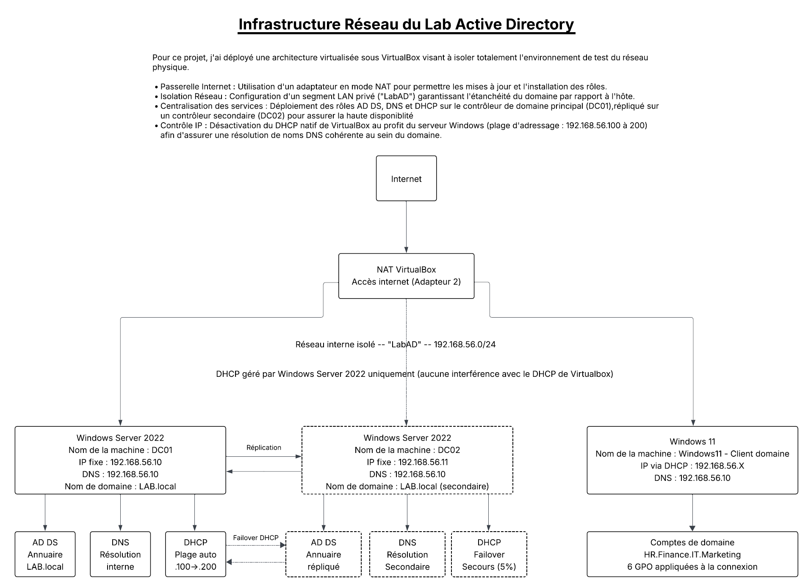
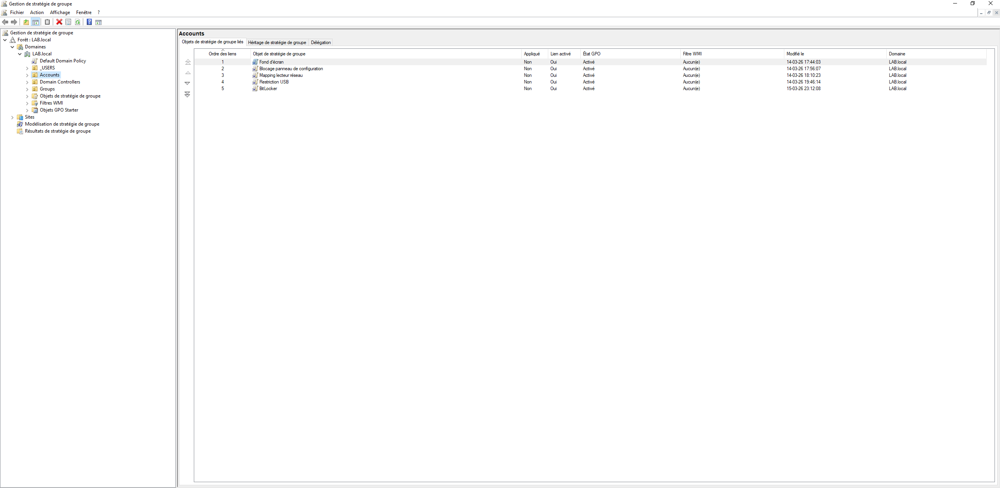
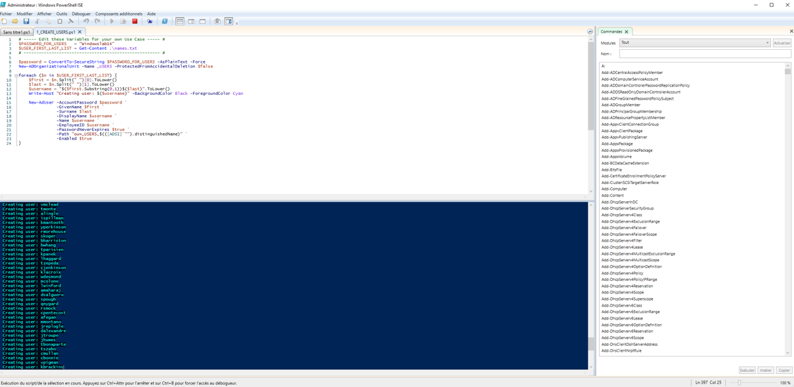

# 🖥️ Laboratoire Active Directory - V1

## 📋 Description
Déploiement d'un environnement Active Directory en laboratoire virtualisé sous VirtualBox.

## 🛠️ Technologies utilisées
- Windows Server 2022 (DC01 + DC02)
- Windows 11 (poste client)
- Active Directory DS
- DNS / DHCP / GPO
- PowerShell
- BitLocker

## 📁 Ce que contient ce projet
- Déploiement et configuration d'un domaine LAB.local
- Haute disponibilité (DC02 + DHCP Failover)
- GPO de sécurité (mots de passe, USB, fond d'écran, audit)
- Automatisation des comptes utilisateurs via PowerShell
- Chiffrement BitLocker
- Stratégies de mots de passe affinées (FGPP/PSO)

## 🌐 Environnement
- Hyperviseur : VirtualBox 7.2.6
- Réseau isolé : 192.168.56.0/24
- Domaine : LAB.local

## 📸 Captures d'écran

### Architecture réseau

### Gestionnaire de serveur

### Groupes et OUs

### GPO

### Réplication AD

### Basculement DHCP

### Script PowerShell

