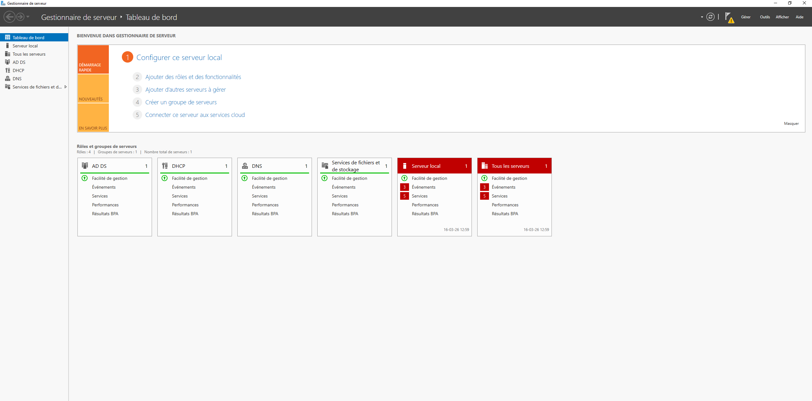
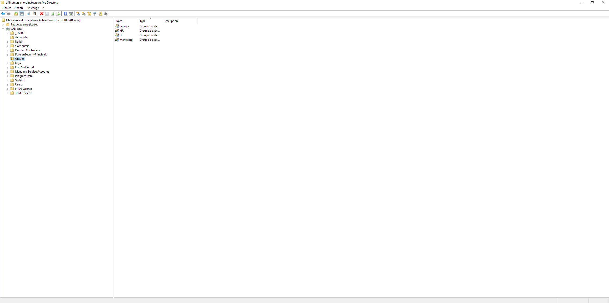
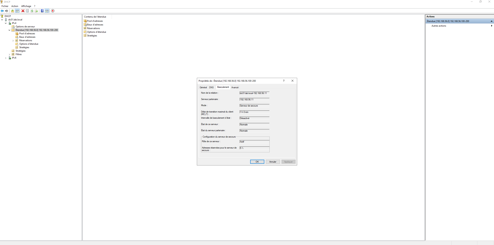

# 🖥️ Lab Active Directory — V1

**Compte-rendu de projet : Mise en place d'un laboratoire Active Directory**
Réalisé par : Tarek Hamroun | Mars 2026

---

## 📋 Description

Déploiement complet d'un environnement Active Directory en laboratoire virtualisé sous VirtualBox.
Le projet couvre l'ensemble du cycle d'administration d'une infrastructure Windows : installation, configuration, sécurisation, haute disponibilité et automatisation.

---

## 🏗️ Architecture

| Machine | Rôle | IP | OS |
|---|---|---|---|
| DC01 | Contrôleur de domaine principal — AD DS, DNS, DHCP | 192.168.56.10 | Windows Server 2022 |
| DC02 | Contrôleur de domaine secondaire — Réplication, DHCP Failover | 192.168.56.11 | Windows Server 2022 |
| CLIENT01 | Poste client de test | DHCP (192.168.56.100–200) | Windows 11 |

- **Hyperviseur :** VirtualBox 7.2.6
- **Réseau :** LAN Segment isolé — 192.168.56.0/24
- **Domaine :** LAB.local

---

## 📁 Contenu du projet

### 1. Environnement virtuel
Installation de VirtualBox 7.2.6 avec Extension Pack. Mise en place d'un réseau LAN Segment isolé pour reproduire un environnement d'entreprise.

### 2. Déploiement des systèmes d'exploitation
- Windows Server 2022 Standard (expérience de bureau) — héberge les rôles AD DS, DNS et DHCP
- Windows 11 — poste client pour valider l'intégration au domaine et tester les GPO

### 3. Configuration du Contrôleur de domaine (DC01)

- Adressage IP statique : 192.168.56.10
- Renommage de la machine en DC01
- Installation du rôle AD DS et promotion en contrôleur du domaine LAB.local
- Configuration automatique du DNS lors de la promotion

### 4. Services Réseaux
- **DHCP :** étendue 192.168.56.100–192.168.56.200
- **DNS :** configuré automatiquement à la promotion du DC, assure la résolution des noms au sein du domaine LAB.local
- **Résolution d'incident :** conflit DHCP entre VirtualBox et le serveur — résolu en désactivant le serveur DHCP intégré de VirtualBox (Fichier > Outils > Network Manager)

### 5. Intégration du poste client
- Configuration DNS statique du client vers 192.168.56.10 (DC01)
- Jonction au domaine LAB.local
- Validation par ouverture de session avec le compte LAB\Administrateur

### 6. Administration et GPO

**Organisation de l'annuaire**

Hiérarchie d'Unités d'Organisation : `_USERS > Accounts` pour les comptes, `Groups` pour les groupes de sécurité (Finance, HR, IT, Marketing).

**Automatisation PowerShell**

Script de création automatique des utilisateurs et placement dans l'OU Accounts — gestion de masse sans erreur humaine.

**GPO déployées**

| GPO | Scope | Paramètres |
|---|---|---|
| Default Domain Policy | Domaine | Mots de passe : 10 caractères minimum, complexité obligatoire, historique 24, expiration 90 jours |
| Verrouillage de compte | Domaine | 3 tentatives échouées → verrou 30 minutes |
| Restriction Panneau de configuration | OU Accounts | Accès bloqué pour tous les utilisateurs |
| Restriction USB | OU Accounts | Lecture, écriture et exécution refusés |
| Fond d'écran entreprise | OU Accounts | Image déployée via NETLOGON sur tous les postes |
| Lecteur réseau H: | OU Accounts | Mapping automatique du partage HR au démarrage de session |
| Audit avancé | Domaine | Validation des identifiants, gestion des comptes, ouverture de session (succès + échec) |

> **Incident GPO fond d'écran :** chemin local initialement utilisé (C:\images\) → non accessible depuis le client. Résolution : déplacement de l'image dans \\LAB.local\NETLOGON\ (dossier répliqué, accessible en lecture par tous les utilisateurs authentifiés).

### 7. Haute disponibilité — Active Directory

- Déploiement du DC02 (192.168.56.11) et jonction au domaine LAB.local
- Réplication AD vérifiée avec `repadmin /showrepl`
- Les deux DC configurés en Catalogue Global — toute la base AD est répliquée des deux côtés
- En cas de panne de DC01, DC02 prend le relais sans interruption de service

### 8. Haute disponibilité — DHCP Failover

- Mode "Serveur de secours" : DC01 gère les baux, DC02 est synchronisé en temps réel
- Secret partagé pour sécuriser la relation de basculement
- Vérification : l'étendue est bien répliquée automatiquement sur DC02

### 9. Chiffrement BitLocker
- GPO "Exiger une authentification supplémentaire au démarrage" activée pour contourner l'absence de puce TPM sur les VMs
- Chiffrement du lecteur C: activé et vérifié sur le poste client
- Données illisibles si le disque est extrait de la machine

### 10. Stratégies de mots de passe affinées (FGPP/PSO)
- **PSO-Admins** (priorité max) : 16 caractères min, historique 24 mots de passe → appliqué au groupe "Admins du domaine"
- **PSO-Users** : 10 caractères min → appliqué aux utilisateurs standards
- Respect du principe du moindre privilège : exigence de complexité maximale uniquement sur les comptes sensibles

---

## 🔧 Technologies utilisées

- Windows Server 2022 — AD DS, DNS, DHCP, GPO, BitLocker, FGPP/PSO
- Windows 11 — poste client
- PowerShell — automatisation des comptes utilisateurs
- VirtualBox 7.2.6 — virtualisation
- Repadmin — vérification de la réplication AD

---

## 📌 Ce que j'ai appris

- Déployer et configurer un domaine Active Directory from scratch
- Diagnostiquer et résoudre des incidents réels (conflit DHCP, GPO fond d'écran)
- Mettre en place une infrastructure redondante (2 DC + DHCP Failover)
- Appliquer le principe du moindre privilège via FGPP et permissions NTFS
- Automatiser la gestion des comptes via PowerShell

---

## 🚀 Prochaines étapes (V2)

- [ ] WSUS — gestion centralisée des mises à jour
- [ ] Azure AD Connect — synchronisation cloud hybride
- [ ] Linux/Ubuntu avec Samba intégré au domaine
- [ ] Scripts PowerShell supplémentaires (audit, rapports)

